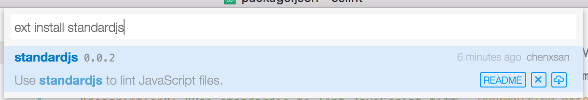

# vscode-standardjs

VSCode extension to integrate [standardjs](https://github.com/feross/standard) into VSCode.

## Installation

1. Press ⌘P(ctrl-p under Linux/Windows) to bring up VSCode Command Palette.
2. Input `ext install standardjs`, vscode would loading all extensions whose name contains `standardjs`.
3. Install the one you want.

    

## Options

You can config standard in visual studio code `settings.json` file:

