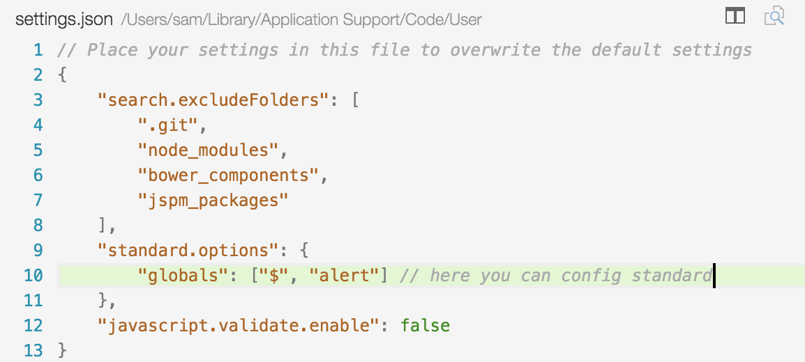

# vscode-standardjs

VSCode extension to integrate [modern-standard](https://github.com/modern-standard/modern-standard) into VSCode.

## Installation

1. Press ⌘P(ctrl-p under Linux/Windows) to bring up VSCode Command Palette.
2. Input `ext install modern-standard`, vscode would loading all extensions whose name contains `modern-standard`.
3. Install the `modern-standard` linter.

## Options

You can config standard in visual studio code `settings.json` file:



You might also need to set `javascript.validate.enable` to false in `settings.json` file, it would disable the default javascript validatation shipped with VS Code.

```
{
	"javascript.validate.enable": false
}
```
